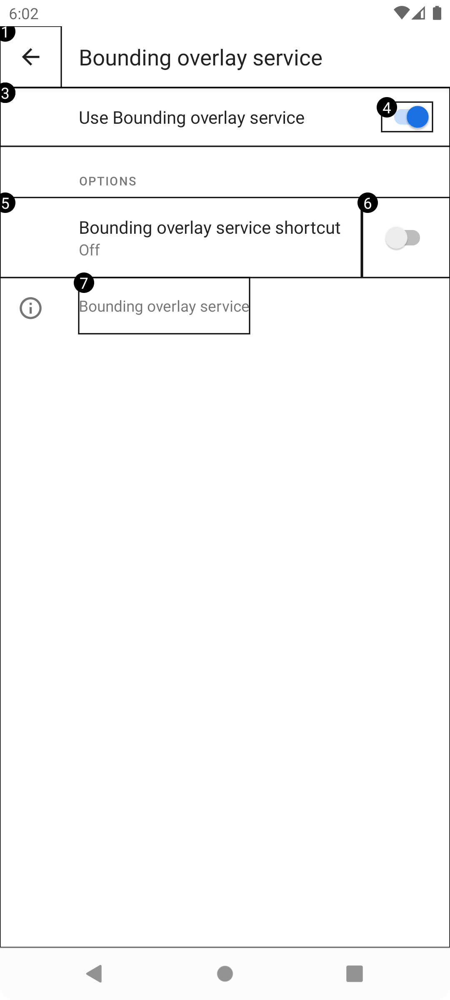
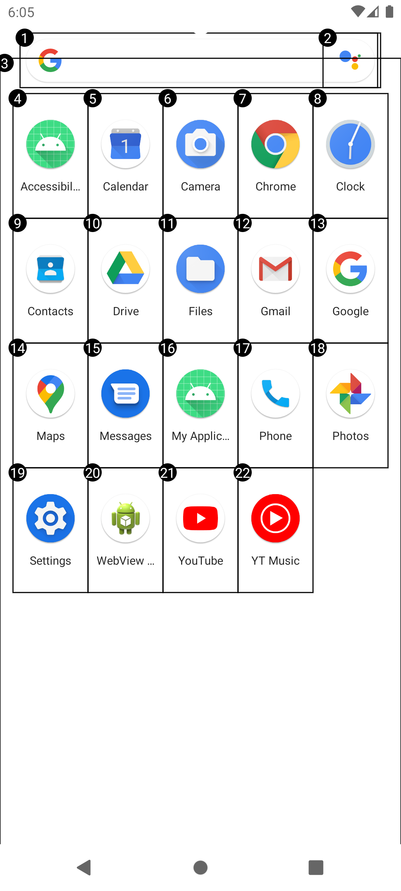

# AccessibilityServiceWithCompose

Sample of AccessibilityService using Jetpack Compose overlay to interactable UI elements on Android
device.

#### Please leave a start if you find it helpful :smile:

### In this sample you will learn

- How to create a
  [lifecycle aware](https://developer.android.com/topic/libraries/architecture/lifecycle)
  Android Service/AccessibilityService
  (
  see [ComponentAccessibilityService.kt](app/src/main/java/androidx/lifecycle/accessibilityservice/ComponentAccessibilityService.kt))
  .

- How to display Jetpack Compose overlay in AccessibilityService
  (
  see [BoundingOverlayService.kt](app/src/main/java/com/aug16vcc/accessibility/BoundingOverlayService.kt))
  .

- How to traverse semantic trees to query interactable ui elements
  (
  see [AccessibilityNodeInfo.kt](app/src/main/java/androidx/core/view/accessibility/AccessibilityNodeInfo.kt))
  .

### How to run demo

1. Install app via Android Studio (of course).
2. Go to `Settings > Accessibility > Bounding overlay service` and start service.
3. Enjoy.

### Preview

| Preview 1               | Preview 2               |
|-------------------------|-------------------------|
|  |  |
